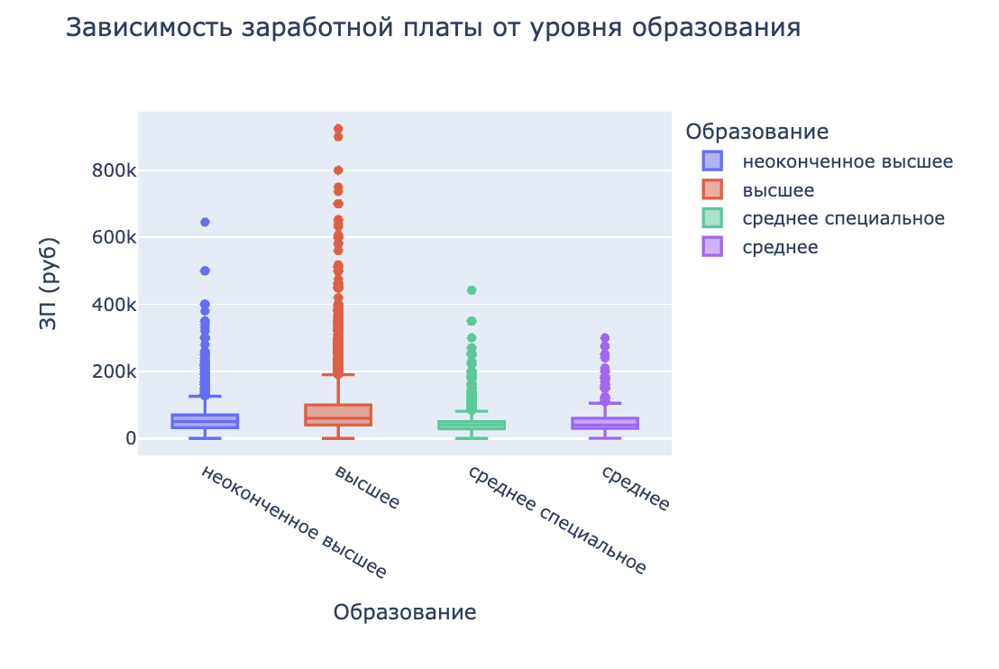
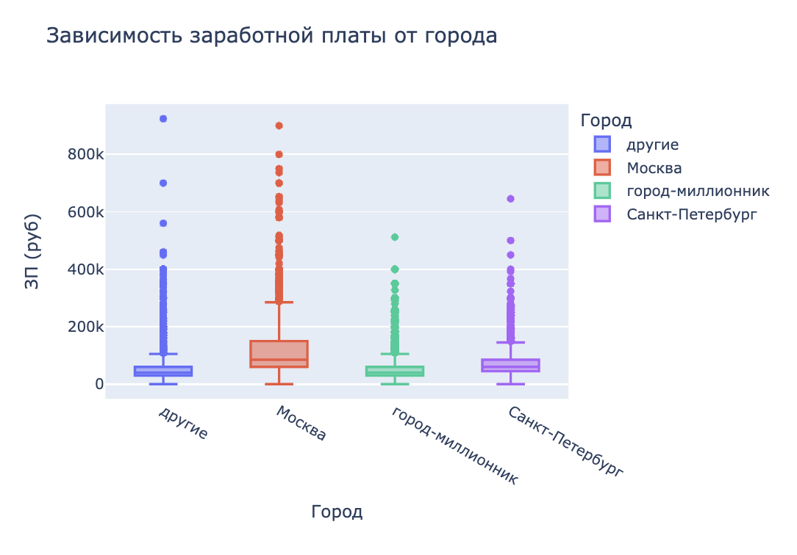
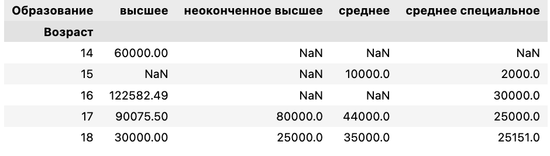
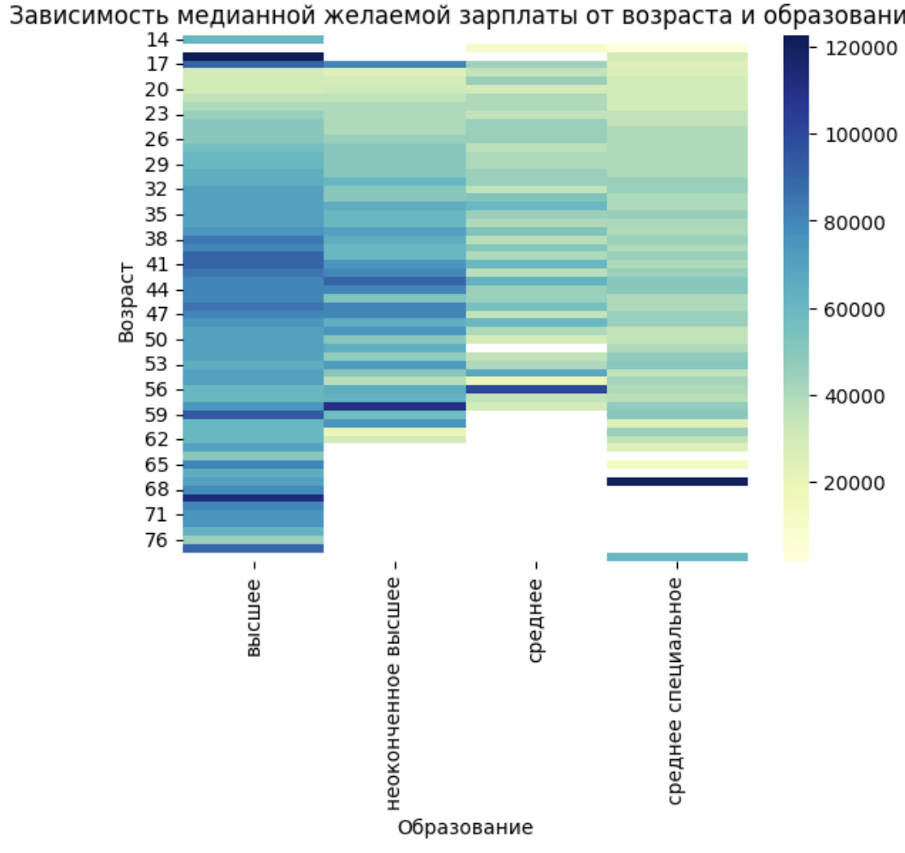
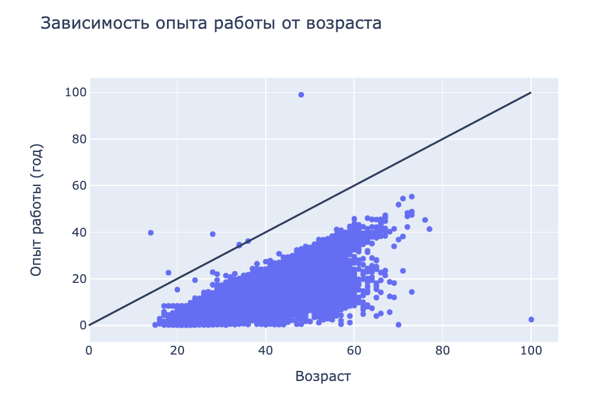
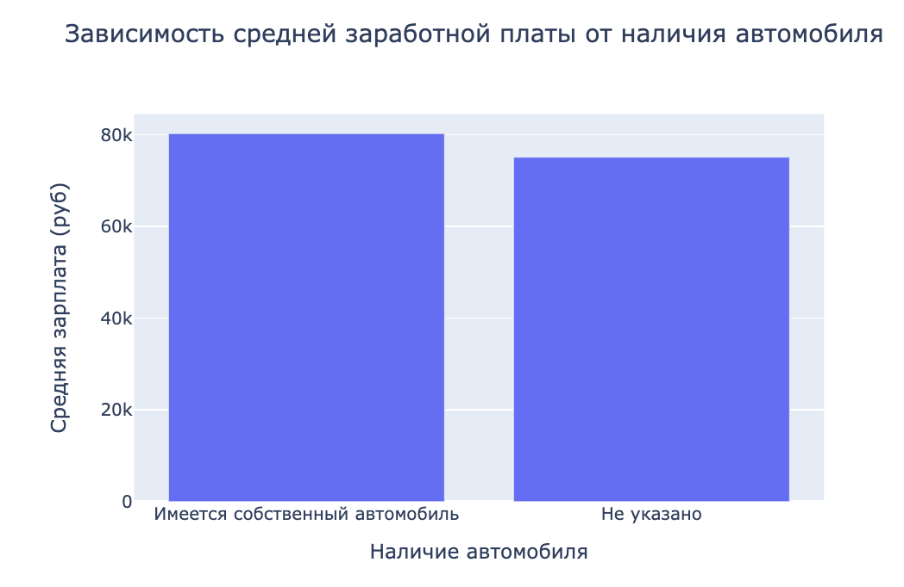
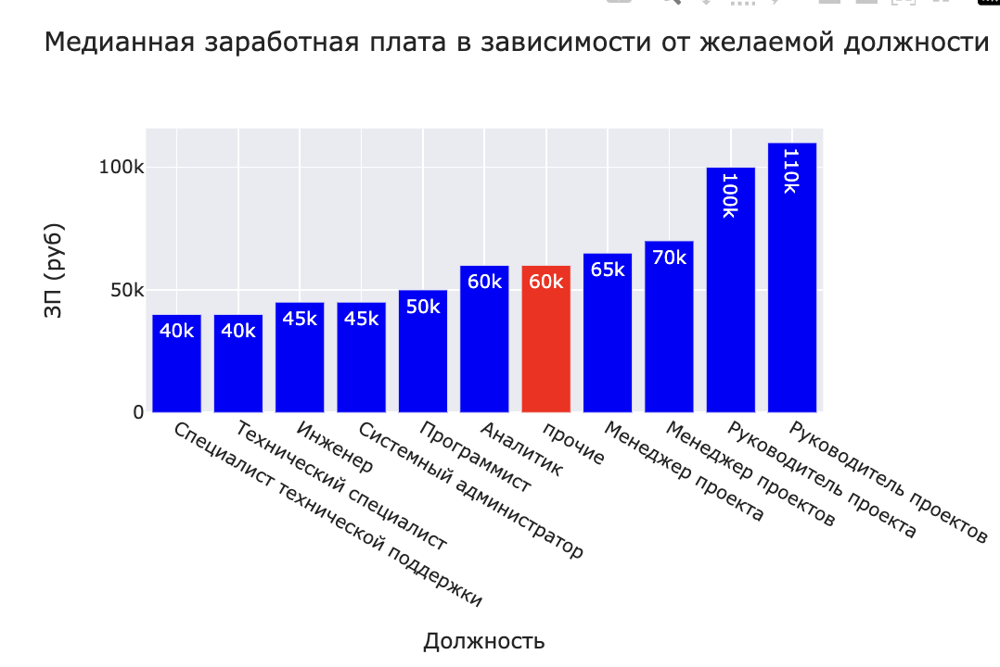
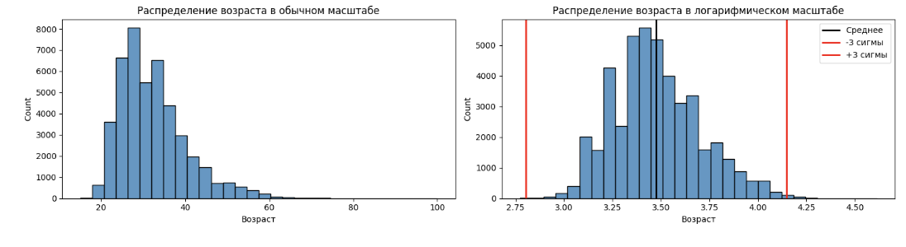

# PROJECT - 1. Анализ резюме из HeadHanter  

## Описание проекта ## 

**Цель проекта:** <u>описание, исследование и очистка данных</u> для построения модели, которая будет определять примерный уровень заработной платы на основе информации, которую указал о себе пользователь. 

**План проекта:**
1) Базовый анализ структуры данных
2) Преобразование данных
3) Разведывательный анализ
4) Очистка данных

**Источники данных:**
  [HH Database](https://drive.google.com/file/d/1Kb78mAWYKcYlellTGhIjPI-bCcKbGuTn/view "Данные о соискателях") (исходные данные о соискателях)

**Использованные библиотеки:** pandas, numpy, matplotlib.pyplot, seaborn, plotly.express

## Исследование структуры данных ##

**Размерность таблицы:** (44744, 12)

**Исходная таблица:**


Информация о столбцах: 

1. **Пол, возраст**: информация о поле, возрасте и дате рождения
2. **ЗП**: желаемая заработная плата в разной валюте (руб., USD и т.д.)
3. **Ищет работу на должность**: желаемая должность 
4. **Город, переезд, командировки**: информация о городе проживания, готовности к переезду и командировкам
5. **Занятость**: выбор занятости (полная занятость, частичная занятость, проектная работа, стажировка, волонтерство)
6. **График**: выбор  графика работы (полный день, сменный график, гибкий график, удалённая работа, вахтовый метод)
7. **Опыт работы**: информация о опыте работы с датами 
8. **Последнее/нынешнее место работы**: где работал/работает соискатель на данный момент
9. **Последняя/нынешняя должность**: должность, которую занимает/занимал соискатель
10. **Образование и ВУЗ**: информация о уровне образования, годе выпуска, ВУЗе и специальности 
11. **Обновление резюме**: дата и время добавления резюме на сайт 
12. **Авто**: информация о наличии автомобиля 

**Пустые значения:** "Опыт работы" (168), "Последнее/нынешнее место работы"(1), "Последняя/нынешняя должность"(2)

**Статистическая информация по столбцам**


## Преобразование данных ##

#### Преобразование признака "Образование и ВУЗ"

Создание с помощью функции-преобразования нового признака **"Образование"**, который должен иметь 4 категории: "высшее", "неоконченное высшее", "среднее специальное" и "среднее".

```python
def count_of_scholl_education(x):
    """
      Функция принимает строку, разделяет ее на слова, оставляет первые 3 и преобразует их к нижнему регистру. 
    Затем проверяет, есть ли в строке ключевые слова, и возвращает соответствующее значение.

    Args:
        x : Строка с описанием образования.

    Returns:
        str: Преобразованное значение образования.
    """

    x = ' '.join(x.split(' ')[:3])
    if 'Высшее' in x:
        return 'высшее'
    elif 'Неоконченное высшее' in x:
        return 'неоконченное высшее'
    elif 'Среднее специальное' in x:
        return 'среднее специальное'
    elif 'Среднее образование' in x:
        return 'среднее'
```

#### Преобразование признака "Пол, возраст"

Создание двух новых признака **"Пол"** и **"Возраст"**

```python
def splitting_gender(x):
    """
    Преобразует строку с полом в сокращение:
    "Мужчина" -> "М"
    "Женщина" -> "Ж"

    Args:
      x : Строка с полом.

    Returns:
      str: Сокращение пола, если пол распознан, иначе None.
      
    """
    x = ' '.join(x.split(' , ')[:1])
    if 'Мужчина' in x:
        return 'М'
    elif 'Женщина' in x:
        return 'Ж' 
```

#### Преобразование признака "Опыт работы"

Из столбца необходимо выделить общий опыт работы соискателя в месяцах и создать новый признак назовём «Опыт работы (месяц)».

Сначала работаем над прежним столбцом: 
```python
def work__experiense(x):
    
    """
    Преобразует строку с описанием опыта работы в число месяцев.

    Args:
        x (str): Строка с описанием опыта работы, например, "1 год 2 месяца".

    Returns:
        int: Число месяцев опыта работы или None, если значение не может быть преобразовано.
    """
    try:
      
        if pd.isnull(x) or x == "Не указано":
            return None  
        x = x.split(' ')
        duration = []
        
        if ("лет" in x or "года" in x or "год" in x) and ("месяц" in x or "месяцев" in x or "месяца" in x):
            duration.append(x[2]) 
            duration.append(x[4]) 
            duration = [int(i) for i in duration if i.isdigit()] 
            full_duration = duration[0] * 12 + duration[1] 
            return full_duration

        elif ("год" in x or "лет" in x or "года" in x) and not ("месяц" in x or  "месяцев" in x or "месяца" in x):
            duration.append(x[2])
            duration = [int(i) for i in duration if i.isdigit()]
            full_duration = duration[0] * 12
            return full_duration

        else:
            duration.append(x[2])
            duration = [int(i) for i in duration if i.isdigit()]
            full_duration = duration[0] * 12
            return full_duration

    except Exception as e:
        return None 
```

```python
def get_experience(x):
    
    """
  Извлекает опыт работы из текстового описания в виде целого числа месяцев.

  Args:
    x: Строка, содержащая описание опыта работы, например: "1 год 6 месяцев" 
        или "2 года". Если значение пустое или равно "Не указано", то возвращается None.

  Returns:
    Целое число, представляющее общее количество месяцев опыта работы. 
    Если значение опыта не удалось извлечь, возвращается None. 
  """

    if x is np.nan or x  == 'Не указано':
        return None
    
    year_words=['год', 'года', 'лет']
    month_words=['месяц', 'месяца', 'месяцев']
    x_splitted = x.split(' ')[:7]
    
    years = 0
    months = 0

    for index, item in enumerate (x_splitted):
        if item in year_words:
            years = int(x_splitted[index-1])
        if item in month_words:
            months = int(x_splitted[index-1])
    return int(years*12 + months)
```

#### Преобразование признака "Город, переезд, командировки"

Разделение столбца на три признака: 
1) «Город»,
2) «Готовность к переезду», 
3) «Готовность к командировкам»

Признак **"Город"** разделен на четыре категории: «Москва», «Санкт-Петербург»,«город-миллионник» и «другие».

Список городов миллионников:
```
million_cities = ['Новосибирск', 'Екатеринбург', 'Нижний Новгород', 'Казань', 'Челябинск', 'Омск', 'Самара', 'Ростов-на-Дону', 'Уфа', 'Красноярск', 'Пермь', 'Воронеж', 'Волгоград' ]
```
Функция преобразования: 
```python
def city(x):
    """"
      Args:
         x : Строка, содержащая название города.

    Returns:
        Строка, классифицирующая город:
            - 'Москва'
            - 'Санкт-Петербург'
            - 'город-миллионник'
            - 'другие'

    Пример:
        >>> classify_city('Москва, Россия')
        'Москва'
        >>> classify_city('Екатеринбург, Россия')
        'город-миллионник'
        >>> classify_city('Саратов, Россия')
        'другие'
    """

    million_cities = ['Новосибирск', 'Екатеринбург', 'Нижний Новгород', 'Казань', 'Челябинск', 'Омск', 'Самара', 'Ростов-на-Дону', 'Уфа', 'Красноярск', 'Пермь', 'Воронеж', 'Волгоград']
    splitted_city = x.split(' , ')[0]
    
    if splitted_city == 'Москва':
        return 'Москва'
    elif splitted_city == 'Санкт-Петербург':
        return 'Санкт-Петербург'
    elif splitted_city in million_cities:
        return "город-миллионник"
    else:
        return "другие"
```

 Признак **«Готовность к переезду»** имеет два возможных варианта: True или False

 Функция преобразования: 

```python
def relocation(x):
    """
  Функция определяет готовность к переезду на основе текста.

  Args:
    x: Текст, содержащий информацию о готовности к переезду.

  Returns:
    True, если в тексте явно указана готовность к переезду,
    False, если в тексте явно указано нежелание переезжать,
    None, если в тексте нет информации о готовности к переезду.
  """

    splitted_data = x.lower().split(' , ')
    for item in splitted_data: 
        if any(keyword in item for keyword in ['не готов к переезду', 'не готова к переезду', 'не хочу переезжать']):
            return False
        elif any(keyword in item for keyword in ['готов к переезду', 'готова к переезду', 'хочу переехать']):
            return True
    return None 
```

Признак **«Готовность к командировкам»** должен иметь два возможных варианта: True или False


```python
def business_travel(x):
    """
  Проверяет текст на готовность к командировкам.

  Args:
      text: Текст, в котором нужно проверить готовность к командировкам.

  Returns:
      True, если в тексте присутствует упоминание о командировке и отсутствует 
      информация о неготовности к ней, иначе False.
  """
    
    if ('командировка' in x):
        if ('не готов к командировкам' in x) or('не готова к командировкам' in x):
            return False
        else: 
            
            return True
    else:
        return False
```
#### Преобразование признаков «Занятость» и «График»

Изначально признаки представляют собой набор категорий желаемой занятости *(полная занятость, частичная занятость, проектная работа, волонтёрство, стажировка)* и желаемого графика работы *(полный день, сменный график, гибкий график, удалённая работа, вахтовый метод)*.

Применение метода преобразования категориальных признаков <u>One Hot Encoding</u> для каждой категории: если категория присутствует в списке желаемых соискателем, то в столбце на месте строки рассматриваемого соискателя ставится True, иначе — False.

Функции для преобразования занятости: 

```python
#функция, которая ищет в столбце "Занятость" значение "полная занятость"
def one_hot_encoding_full_employment(x):
    if ('полная занятость' in x):
        return True
         
    return False

#функция, которая ищет в столбце "Занятость" значение "частичная занятость"
def one_hot_encoding_part_time_employment(x):
    if ('частичная занятость' in x):
        return True
         
    return False

#функция, которая ищет в столбце "Занятость" значение "поектная работа"
def project_work(x):
    if ('проектная работа' in x):
        return True
         
    return False

#функция, которая ищет в столбце "Занятость" значение "стажировкаь"
def internship(x):
    if ('стажировка' in x):
        return True
         
    return False

#функция, которая ищет в столбце "Занятость" значение "волонтерство"
def volunteering(x):
    if ('волонтерство' in x):
        return True
         
    return False
```

Функции для преобразования графика:


```python
def full_day(x):
    if ('полный день' in x):
        return True
         
    return False

def shift_schedule(x):
    if ('сменный график' in x):
        return True
         
    return False

def flexible_schedule(x):
    if ('гибкий график' in x):
        return True
         
    return False

def remote_work(x):
    if ('удаленная работа' in x):
        return True
         
    return False

def rrotational_method(x):
    if ('вахтовый метод' in x):
        return True
         
    return False
```

#### Преобразование признака "ЗП"

Перевод в рубли.


Информация о курсе валют хранится в ExchangeRates.csv

```python
def get_salary_num(arg):
    """
    Извлекает числовое значение зарплаты из строки.
    Функция принимает строку, содержащую зарплату, и возвращает ее числовое значение в виде float.
    
    Args:
    arg: Строка, содержащая зарплату.
    
    Returns:
    float: Числовое значение зарплаты.
    """
    salary = float(arg.split(' ')[0])
    return salary
```

```python
def get_salary_сurrency(arg):
    """Возвращает валюту в нужном формате.

  Args:
    arg: Строка, содержащая информацию о зарплате, например "100 000 руб", "1000 USD", "50000 грн".

  Returns:
    Валюта в стандартном формате, например "RUB", "USD", "UAH".

  Примеры:
    >>> get_salary_currency("100 000 руб")
    'RUB'
    >>> get_salary_currency("1000 USD")
    'USD'
    >>> get_salary_currency("50000 грн")
    'UAH'
  """
    currency_dict = {
        'USD': 'USD', 
        'KZT': 'KZT',
        'грн': 'UAH', 
        'белруб': 'BYN',
        'EUR': 'EUR', 
        'KGS': 'KGS',
        'сум': 'UZS', 
        'AZN': 'AZN'
    }
    curr = arg.split(' ')[1].replace('.', '')
    if curr == 'руб':
        return 'RUB'
    else:
        return currency_dict[curr]
```

Итог этого раздела: 


## Исследование зависимостей в данных ##

#### Распределение признака «Возраст»


* Наиболее часто встречающееся в возрастном ряду значение - **30 лет**
* Возраст большинства соискателей находится в интервале **от 27 до 36 лет**
* После анализа коробчатой диаграммы, я могу сделать вывод, что в данных прослеживаются выбросы. Это можно увидеть по точкам, которые выходят за пределы усов (данные точки начинаются с значения 50 и заканчиваются значением 100). Аномалией можно считать возраст 100 лет. 

#### Распределение признака «Опыт работы (месяц)»


* Рассматривая гистограмму, можно сделать вывод, что мода распределения равна **80-84 месяца** (1414 человек)
* Коробчата диаграмма показывает, что примерный интревал опыта работы для большинства соискателей - **от 57 месяцев до 154 месяцев**
* Анамальные значения в данных имеются, например самый высокий показатель опыта - 1188 месяцев, это 99 лет (такого быть не может)

#### Распределение признака «ЗП (руб)»


* Большинство соискателей хотят получать зарплату в размере **47.5-52.49 тыс.руб**
* У большинства соискателей заработная плата находится в интервале **от 37 тыс до 95 тыс. руб**
* Аномалии в данных имеются, например, зарплата 24,3 млн, данная аномалия спостобна искозить анализ 

#### Зависимость медианной желаемой заработной платы ("ЗП (руб)") от уровня образования ("Образование")



* Наибольший уровень заработной платы наблюдается у соискателей, которые окончили высшее образование, пиком является значение **923 983 тыс. руб** (это отфильтрованные данные до 1 мил рублей). Наименьший уровень заработной платы прослеживается у соискателей со средним образованием и составляет **300 тыс. руб.**
* Признак уровня образования при прогнозировании заработной платы - важен, поскольку более квалифицированные специалисты получают больше, чем те, кто закончил только школьное образование. В пример, можно взять архитектора, он явно будет получать больше, поскольку он получил образование и занимается делом, которым человек со средним образованием заниматься не сможет. 

#### Распределение желаемой заработной платы ("ЗП (руб)") в зависимости от города ("Город")



* Медианное значение: для Москвы составляет **85 тыс.руб**, для Санкт_Петербурга - **60 тыс.руб**, для городов-миллионников - **40 тыс.руб**, для других городов - **40 тыс.руб**. Это дает нам понять, что в Москве люди хотят получать зарплату больше, нежели в других городах. Что касается размаха, то самый высокий в Москве (от 1 тыс.руб до 285 тыс.руб), размах в городах-миллионниках и других городах одинаковый и составляет от 1 тыс. руб до 105 тыс. руб 
* По моему мнению, для прогнозирования заработной платы признак города важен, поскольку в больших городах прожиточный минимум выше, что однозначно влияет на заработную плату. Напрмер, если опираться на официальную информацию, то согласно постановлению правительства Москвы от 17 октября 2023 года № 1961-ПП, величина прожиточного минимума в Москве на 2024 год составляет для трудоспособного населения — 25 879 рублей, а в Саранске согласно документу, величина прожиточного минимума на душу населения для трудоспособного населения — 14 317 рублей. 

#### Зависимость медианной заработной платы ("ЗП (руб)") от признаков "Готовность к переезду" и "Готовность к командировкам"


* Для тех, кто готов к переезду и готов к командировкам ожидаемая зарплата составляет **65,8 тыс.руб.** Это самый высокий показатель ожидаемой заработной платы. 
* Для тех, кто готов к переезду и не готов к командировкам ожидаемая заработная плата составляет **50 тыс.руб.**
* Для тех, кто не готов к переезду и готов к комавндировкам ожидаемая заработная плата **60 тыс.руб.**
* Для тех, кто не готов к переезду и не готов к командировкам ожидаемая заработная плата составляет **40 тыс.руб.**
* Если соискатель готов к командировкам, то его ожидаемая заработная плата как правило выше

#### Зависимость медианной желаемой заработной платы от возраста («Возраст») и образования («Образование»).

Сводная таблица для построаения тепловой карты 





* Самый быстрый карьерный рост наблюдается у тех соискателей, кто имеет высшее образование. 
* Для тех соискателей, кто имеет незаконченное высшее также имеет карьерный рост, но он не так выражен, нежели у тех, кто имеет оконченное высшее. 
* Слабый карьерный рост наблюдается у тех, кто имеет среднее специальное образование. 

#### Зависимость опыта работы («Опыт работы (месяц)») от возраста («Возраст»)

Приведение столбца «Опыт работы (месяц)» в годы, чтобы признаки были в едином масштабе.


* Чем старше возраст, тем выше опыт работы. 

#### Зависимость редней заработной платы от наличия автомобиля



Данный график позволяет нам понять, что наличие автомобиля - повод желать заработную плату выше, нежели при отсутствии такой информации в анкете. Средняя заработная плата для соискателей с личным автомобилем составляет примерно 80 тыс.руб, а для тех кто не указал или не имеет автомобиль 75 тыс.руб. 

#### Медианная заработная плата в зависимости от желаемой должности



Эта столбчатая диаграмма илюстрирует медианную заработную плату в соответствии с должностью. Таким образом, самое высокое медианное значение заработной платы у должности руководителя проектов - **110 тыс.руб.**, самая низкая у специалиста технической поддержки и технического специалиста (эти две должности имею медианную заработную плату в размере **40 тыс.руб**)

## Очистка данных ##

#### 1) Удаление дубликатов 

Количество дубликатов в двнных: **161**

```python
merged_data = merged_data.drop_duplicates ()
```

#### 2) Работа с пропущенными значениями 

В данных присутствуют пропущенные значения в трех столбцах: "Опыт работы (месяц)" (**168**), "Последнее/нынешнее место работы" (**1**), "Последняя/нынешняя должность" (**2**)

Так как в столбце "Опыт работы (месяц)" достаточно много пропущенных значений, необходимо заполнить их медианным значением: 

```python
merged_data['Опыт работы (месяц)'] = merged_data['Опыт работы (месяц)'].fillna(merged_data['Опыт работы (месяц)'].median())
```
Столбцы "Последнее/нынешнее место работы", "Последняя/нынешняя должность" имеют незначительное количество пропусков, поэтому строки с пропусками можно удалить: 

```python
merged_data = merged_data.dropna ()
```
#### 3) Ликвидация выбросов 

Выбросами можно считать данные, *в которых указана заработная плата либо выше 1 миллиона рублей, либо ниже 1 тысячи рублей*.

Количество выбросов в данных: **84**

```python
filter_outliers = merged_data[merged_data['ЗП (руб)'] > 1000000.0] 
filter_outliers_2 = merged_data[merged_data['ЗП (руб)'] < 1000.0]
hh_clean = merged_data.drop(filter_outliers.index, axis=0) 
hh_clean = hh_clean.drop(filter_outliers_2.index, axis=0) 
```
#### Ликвидация выбросов в признаке "Возраст"

В этом случае - это резюме людей, чей возраст слишком преклонный для поиска работы.

Использование распределения признака в логарифмическом масштабе: 



```python
def outliers_z_score(data, feature,left=3, right=4, log_scale=False):
    """
    Функция для обнаружения и удаления выбросов с использованием z-оценки.

  Args:
    data (pandas.DataFrame): Данные, в которых необходимо обнаружить выбросы.
    feature (str): Название столбца с данными, которые требуется проверить.
    left (int, optional): Левая граница z-оценки для определения выбросов. По умолчанию 3.
    right (int, optional): Правая граница z-оценки для определения выбросов. По умолчанию 4.
    log_scale (bool, optional): Флаг, указывающий на необходимость логарифмирования данных перед обработкой. По умолчанию False.
  Returns:
    tuple: Кортеж из двух DataFrame:
      - outliers (pandas.DataFrame): DataFrame с выбросами.
      - cleaned (pandas.DataFrame): DataFrame без выбросов.
    """
    if log_scale:
        x = np.log(data[feature]+1)
    else:
        x = data[feature]
    mu = x.mean()
    sigma = x.std()
    lower_bound = mu - 3 * sigma
    upper_bound = mu + 4 * sigma
    outliers = data[(x < lower_bound) | (x > upper_bound)]
    cleaned = data[(x >= lower_bound) & (x <= upper_bound)]
    return outliers, cleaned
```

* Число выбросов по методу z-отклонения: **3**
* Результирующее число записей: **44482**
* Возраст выбросов: **15, 15, 100**
